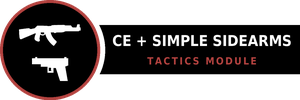
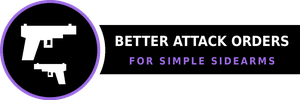

# Pawns Optimize Weapon Quality

[](https://github.com/eebette/Pawns-Optimize-Weapon-Quality/releases)
<!-- Steam Workshop badge goes here at publish -->


[](https://steamcommunity.com/sharedfiles/filedetails/?id=2890901044)

RimWorld mod that changes pawn behavior to automatically swap weapons to a higher quality version when available.

Pawns will now periodically scan the map for higher quality (or higher hit point) versions of their held guns, and fetch
them when one is available.

## Load order

> Harmony → this mod.

## My other mods

### Combat Extended + Simple Sidearms Compatibility Suite


Mods that make Combat Extended and Simple Sidearms run smoothly together.

<table>
<tr><th>Module</th><th width="540">What it does</th></tr>
<tr><td width="300"><a href="https://github.com/eebette/CombatExtended-SimpleSidearms-Compatibility-Patch"></a></td><td width="540">Core compatibility patch for Combat Extended and Simple Sidearms.</td></tr>
<tr><td width="300"><a href="https://github.com/eebette/CombatExtended-SimpleSidearms-Compatibility-Loadouts"></a></td><td width="540">Synchronizes CE Loadouts with SS memory/gizmo.</td></tr>
<tr><td width="300"><a href="https://github.com/eebette/CombatExtended-SimpleSidearms-Compatibility-Tactics"></a></td><td width="540">Sensible tweaks to nonsense pawn behavior when CE + SS run together.</td></tr>
</table>

### Standalone

<table>
<tr><th>Mod</th><th width="540">What it does</th></tr>
<tr><td width="300"><a href="https://github.com/eebette/Better-Attack-Orders-for-Simple-Sidearms"></a></td><td width="540">Adds sidearm attack orders to the right-click target menu.</td></tr>
<tr><td width="300"><a href="https://github.com/eebette/Universal-Patch-for-More-Materials"></a></td><td width="540">Adds materials from <a href="https://steamcommunity.com/sharedfiles/filedetails/?id=3055040889">More Materials</a> to non-vanilla recipes.</td></tr>
</table>

## FAQ

**CE compatible?**

Yup!

**Can I add or remove it mid-save?**

Yep.

**Does it change balance?**

It makes the game easier because it automates pawn loadout optimization.

**AI?**

This mod was engineered with the help of an AI Coding Assistant (Claude Code, Fable 5, Max effort). The amount of
researching and deep-diving the compatibility interfaces of mods that it patches would have been insurmountable without
it.

Development followed a standard process driven and scrutinized by me (the real human person writing this):
explore, design, build, test, fix, review, scrutinize, test again over many rounds.

I have manually reviewed and verified all code in this mod.

I ask that if you have unconstructive feedback regarding the usage of AI while developing this mod, that it remains
outside of this community space. Thank you.

## Building

```bash
dotnet build Source/PawnsOptimizeWeaponQuality/PawnsOptimizeWeaponQuality.csproj -c Release
```

Requires only the .NET SDK. The mod compiles against NuGet packages alone -
[Krafs.Rimworld.Ref](https://www.nuget.org/packages/Krafs.Rimworld.Ref) 1.6 and
[Lib.Harmony](https://www.nuget.org/packages/Lib.Harmony) 2.3.3 - with no local Steam or workshop DLLs. Combat Extended
and Simple Sidearms are reached by reflection at runtime, so neither is a build reference; the assembly loads with or
without them. Output lands in `Assemblies/`. With no local references, the build is CI-friendly.

## Testing

Automated end-to-end tests run in two profiles, because Combat Extended is optional.

**With Combat Extended** (Core + Harmony + CE + this mod):

```bash
./test/run-lq-stage.sh                     # build + stage the CE saves
./test/run-lq-assert.sh lq1 LQ-1-ranged    # load + assert one scenario
```

Five scenarios `lq1`..`lq5`: ranged quality swap, melee ranking (quality and material), HP-bucket tiebreak, min-quality
floor, and equipped-melee-primary (no wielder-skew ping-pong).

**Without Combat Extended** (Core + Harmony + this mod - the vanilla path):

```bash
./test/run-lqv-test.sh
```

`lqv` arranges and asserts in one run: equipped-ranged, inventory-melee, and equipped-melee swaps all fire via the
vanilla trigger, each dropping the old copy unforbidden.

Details and recorded passes: [`TESTPLAN.md`](TESTPLAN.md).

## License

[MIT](LICENSE) - code, build files, and docs.

The badge artwork is not: `About/Preview.png` and the `Media/Badge_*.png` set remix the rifle glyph from Combat
Extended's own compatibility badge, so they stay under CE's CC BY-NC-SA 4.0 (attribution, non-commercial, share-alike).
Details in [NOTICE](NOTICE).
